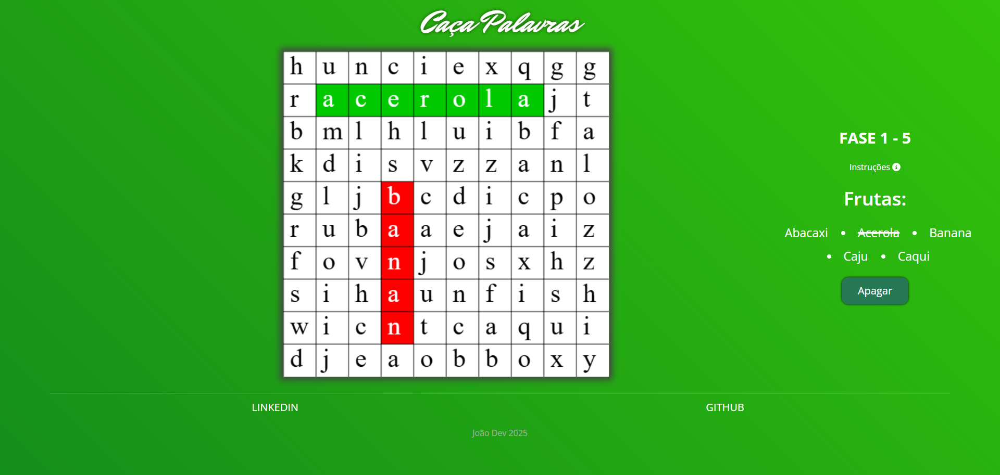
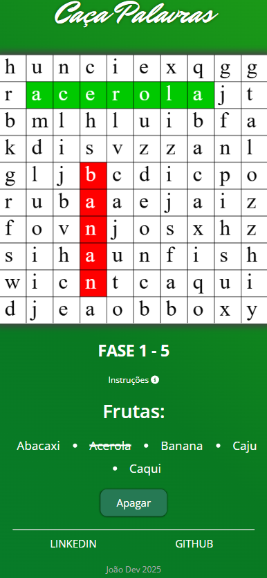

# Caça-Palavras

## Descrição

Este é um projeto de um jogo de Caça-Palavras com temática de frutas. O objetivo do jogo é encontrar todas as palavras escondidas no tabuleiro.

O jogo é composto por 5 fases, cada uma contendo um conjunto único de palavras que não se repetem. Após concluir uma fase, o jogador pode optar por repetir a fase já concluída, onde as palavras serão reposicionadas aleatoriamente, ou avançar para a próxima fase com um novo conjunto de palavras.

### Como jogar
- Para selecionar uma palavra, clique nas letras na ordem correta.
- Se clicar em uma letra errada, utilize o botão "Apagar" para limpar sua seleção.
- Quando encontrar uma palavra corretamente, a seleção mudará de vermelho para verde, indicando que foi encontrada.
- No campo "Fruta", onde estão listadas as palavras a serem encontradas, as palavras já identificadas ficarão riscadas.
- Se o jogador tiver duvidas sobre o jogo, basta clicar em "Instruções" e uma caixa de texto irá descer com as principais instruções do jogo, para fecha-la basta clicar no "X", situado no canto superior direito da caixa.

### Tecnologias utilizadas
- **Angular com TypeScript**: para uma estrutura modular e tipagem segura.
- **Angular CLI**: para facilitar a configuração e gerenciamento do projeto.
- **Angular Services e Components**: para estruturação organizada e reutilizável do código.

O projeto segue o conceito de **mobile first**, garantindo uma experiência responsiva e acessível para dispositivos móveis.

### Scripts disponíveis:

No diretório do projeto, é possível executar os seguintes scripts:

#### `npm install`

Instala todas as dependências do projeto.

#### `ng serve`

Executa o aplicativo no modo de desenvolvimento. Abra [http://localhost:4200](http://localhost:4200) para visualizá-lo no seu navegador. A página será recarregada quando você fizer alterações. É possível ver erros de lint no console.

#### `ng build`

Cria o aplicativo para produção na pasta `dist/`. A compilação é minificada e a aplicação fica pronta para ser implantado!

#### Mais ajuda

Para obter ajuda sobre o Angular CLI, use `ng help` ou confira a página [Visão geral e referência de comandos do Angular CLI](https://angular.io/cli).

## Possíveis melhorias

- Melhorar o design para torná-lo mais temático e atrativo.
- Adicionar um painel de seleção inicial para diferentes categorias de palavras.
- Implementar um sistema de pontuação.
- Adicionar um cronômetro para registrar o tempo que o jogador leva para completar cada fase.

## Design do projeto no Desktop:

## Design do projeto no Mobile:

---

Este projeto é uma ótima forma de testar suas habilidades de observação e se divertir encontrando diversas frutas escondidas no tabuleiro!